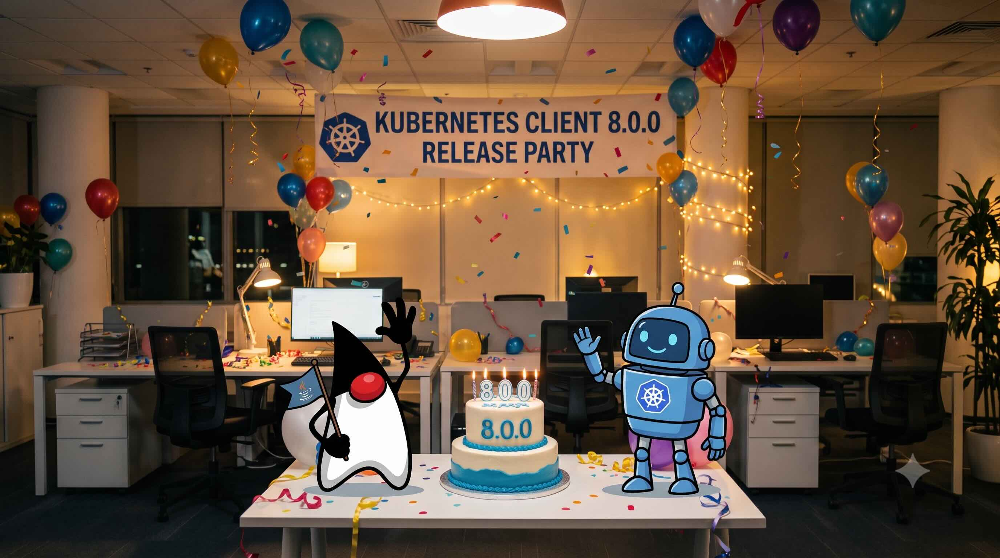

I'm thrilled to announce **Fabric8 Kubernetes Client v8.0.0** - a major release that modernizes the library's foundation while delivering critical stability and security improvements.

This release marks a significant milestone: upgrading to **Jackson 3**, raising the Java baseline to **Java 17**, and fixing long-standing proxy authentication issues across all HTTP client implementations.

---

## What is Fabric8 Kubernetes Client?

The [Fabric8 Kubernetes Client](https://github.com/fabric8io/kubernetes-client) is the most widely-used Java client library for Kubernetes and OpenShift. It powers operators, enterprise applications, and frameworks like Quarkus and the Java Operator SDK (JOSDK) - enabling Java developers to interact with Kubernetes clusters with a fluent, type-safe API.

---

## What's New in v8.0.0

### Major Version Upgrades

**Jackson 2 → Jackson 3**: We've migrated to Jackson 3, the latest JSON processing library. The default serialization behavior remains compatible with Jackson 2, so most applications will migrate smoothly. See the [migration guide](https://github.com/fabric8io/kubernetes-client/blob/main/doc/MIGRATION-v8.md#jackson-3) for custom mappers.

**Java 11 → Java 17**: The library now requires Java 17+ (both for runtime and build-time). This aligns with current industry standards and enables use of modern Java language features.

### Proxy Authentication Fixes

This release delivers comprehensive fixes to proxy handling across **all HttpClient implementations** (Vert.x 5, Vert.x 4, Jetty, OkHttp, JDK):

- Proxy passwords containing colons now work correctly
- Proxy URLs with a user and no password are handled per RFC 7617
- SOCKS5 proxy credentials are sent properly
- Proxy credentials no longer leak through to the API server on HTTPS and WebSocket tunnels

These fixes resolve long-standing issues in enterprise proxy environments where standard patterns like `proxy.example.com:8080` were breaking client connections.

### WebSocket Reliability

WebSocket connections now send pings every 30 seconds (configurable via `Config#websocketPingInterval`), preventing load balancers from closing idle watch connections. This applies consistently across all HttpClient implementations and eliminates silent watch disconnections.

### Java Temporal Types

Proper handling of `java.sql.Date`, `java.time` types, and other temporal classes:
- Dates are now read/written with correct timezone semantics
- CRD generator produces schemas that match what the client serializes
- No more "invalid date" columns in CRD printer columns

### Typed DSL for Kubernetes 1.37 Resources

While Kubernetes 1.37 support was added in v7.9.0, v8.0.0 completes the typed DSL accessors:
- `certificates().v1().podCertificateRequests()`
- `dynamicResourceAllocation().v1().deviceTaintRules()`
- `storageMigration().v1().storageVersionMigrations()`
- `scheduling().v1beta1().podGroups()` and `workloads()`

---

## Breaking Changes

This is a **major version** with several breaking changes. Most applications will migrate smoothly, but **you must review the migration guide**:

- **Jackson 3 coordinate and package changes** (tools.jackson namespace)
- **Java 17 requirement** for runtime and build
- **CRD Generator v1 removed** - migrate to v2 (Maven plugin, CLI, or Gradle)
- **DSL changes**: `runtimeClasses()` and `network().ingresses()` now use `v1` instead of `v1beta1`

**Please read the [migration guide](https://github.com/fabric8io/kubernetes-client/blob/main/doc/MIGRATION-v8.md) before upgrading.**

---

## Getting Started

Update your dependency to:

```xml
<dependency>
    <groupId>io.fabric8</groupId>
    <artifactId>kubernetes-client</artifactId>
    <version>8.0.0</version>
</dependency>
```

For a comprehensive overview of all changes, see the [release on GitHub](https://github.com/fabric8io/kubernetes-client/releases/tag/v8.0.0).

---

## Thank You

This release represents months of work from the Fabric8 team and community. Special thanks to everyone who reported proxy issues, WebSocket disconnections, and temporal type handling - your feedback drives these improvements.

As always, we welcome contributions, bug reports, and feature requests on [GitHub](https://github.com/fabric8io/kubernetes-client). Happy Kuberneting! 🚀